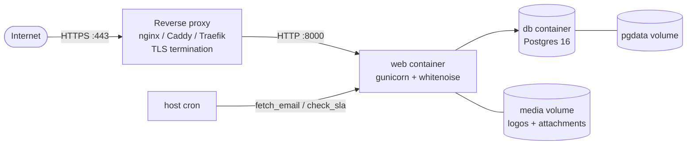

# Deploying Deskless

A step-by-step guide to running Deskless in production. The supported path is
**Docker Compose** (app + Postgres) behind a **reverse proxy** that terminates
TLS. Everything here assumes a single Linux host; scale-out notes are at the end.

- [1. What you need](#1-what-you-need)
- [2. Get the code](#2-get-the-code)
- [3. Configure `.env`](#3-configure-env)
- [4. Start the stack](#4-start-the-stack)
- [5. Create the first admin](#5-create-the-first-admin)
- [6. Put TLS in front (reverse proxy)](#6-put-tls-in-front-reverse-proxy)
- [7. Scheduled jobs (email intake + SLA)](#7-scheduled-jobs-email-intake--sla)
- [8. Email (SMTP + IMAP)](#8-email-smtp--imap)
- [9. SSO (Google / Microsoft / Zoho)](#9-sso-google--microsoft--zoho)
- [10. Backups](#10-backups)
- [11. Updating to a new version](#11-updating-to-a-new-version)
- [12. Troubleshooting](#12-troubleshooting)
- [13. Scaling beyond one host](#13-scaling-beyond-one-host)

---

## Architecture



The `web` container serves the app on port 8000 (plain HTTP) and its own static
files via whitenoise. Postgres and uploaded media each live on a named Docker
volume so they survive rebuilds. TLS is the proxy's job, not the app's.

---

## 1. What you need

- A Linux host (1 vCPU / 1 GB RAM is enough to start) with a public IP.
- A domain name pointing at it (e.g. `helpdesk.example.com`).
- **Docker** and the **Docker Compose plugin** installed:
  ```bash
  curl -fsSL https://get.docker.com | sh
  ```
- Ports **80** and **443** open. Port 8000 should **not** be public — only the
  proxy talks to it.

## 2. Get the code

```bash
git clone https://github.com/akheels-web/Deskless.git
cd Deskless
```

## 3. Configure `.env`

```bash
cp .env.example .env
```

Edit `.env`. The must-change values for production:

| Variable | Set it to |
|----------|-----------|
| `SECRET_KEY` | A long random string — generate one: `python -c "import secrets; print(secrets.token_urlsafe(50))"` |
| `DEBUG` | `False` |
| `ALLOWED_HOSTS` | Your domain, e.g. `helpdesk.example.com` |
| `CSRF_TRUSTED_ORIGINS` | `https://helpdesk.example.com` |
| `DB_PASSWORD` | A strong database password |
| `DEFAULT_FROM_EMAIL` | The address support email comes from |

Leave `EMAIL_HOST` / `IMAP_HOST` blank for now if you're not wiring email yet —
outbound mail falls back to the console and email-to-ticket stays off. Branding
(`BRAND_*`) is optional here; it's also editable in-app under **Settings**.

> **Security:** when `DEBUG=False`, Deskless automatically turns on HTTPS
> redirect, secure cookies, and HSTS, and trusts the `X-Forwarded-Proto` header
> from your proxy. So the proxy **must** set that header (examples below).

## 4. Start the stack

```bash
docker compose up -d --build
```

This builds the image, runs database migrations automatically (via
`entrypoint.sh`), and starts gunicorn. Check it's healthy:

```bash
docker compose ps
docker compose logs -f web
curl -I http://localhost:8000/accounts/login/   # expect 200 or 302
```

## 5. Create the first admin

```bash
docker compose exec web python manage.py createsuperuser
```

Log in at `https://your-domain/` once the proxy (next step) is up. This account
is an **admin** — it can manage the team, settings, and SSO.

## 6. Put TLS in front (reverse proxy)

Deskless serves plain HTTP on 8000. Terminate TLS with a proxy. Two common
options — pick one.

### Caddy (simplest — automatic HTTPS)

`/etc/caddy/Caddyfile`:

```
helpdesk.example.com {
    reverse_proxy localhost:8000
}
```

Caddy fetches and renews Let's Encrypt certs automatically and sets
`X-Forwarded-Proto` for you. `sudo systemctl reload caddy` and you're done.

### nginx + certbot

`/etc/nginx/sites-available/deskless`:

```nginx
server {
    listen 80;
    server_name helpdesk.example.com;

    client_max_body_size 25m;   # allow ticket attachments

    location / {
        proxy_pass http://127.0.0.1:8000;
        proxy_set_header Host $host;
        proxy_set_header X-Forwarded-For $proxy_add_x_forwarded_for;
        proxy_set_header X-Forwarded-Proto $scheme;   # required for HTTPS detection
    }
}
```

```bash
sudo ln -s /etc/nginx/sites-available/deskless /etc/nginx/sites-enabled/
sudo nginx -t && sudo systemctl reload nginx
sudo certbot --nginx -d helpdesk.example.com   # adds TLS + auto-renew
```

> The `client_max_body_size` (nginx) matters — without it, large attachment
> uploads fail with a 413. Caddy has no default limit.

## 7. Scheduled jobs (email intake + SLA)

Two management commands are meant to run on a schedule. Add them to the host's
crontab (`crontab -e`):

```cron
# Pull inbound email into tickets every 2 minutes (only if IMAP is configured)
*/2 * * * * cd /path/to/Deskless && docker compose exec -T web python manage.py fetch_email >> /var/log/deskless-email.log 2>&1

# Flag SLA breaches and email owners every 15 minutes
*/15 * * * * cd /path/to/Deskless && docker compose exec -T web python manage.py check_sla >> /var/log/deskless-sla.log 2>&1
```

The `-T` flag is important — it disables TTY allocation so the commands run
cleanly from cron. Skip the `fetch_email` line if you're not using
email-to-ticket.

## 8. Email (SMTP + IMAP)

**Outbound (SMTP)** — needed for reply, assignment, SLA-breach, and CSAT emails.
Fill in `.env`:

```
EMAIL_HOST=smtp.yourprovider.com
EMAIL_PORT=587
EMAIL_HOST_USER=your-smtp-user
EMAIL_HOST_PASSWORD=your-smtp-password
EMAIL_USE_TLS=True
DEFAULT_FROM_EMAIL=support@yourcompany.com
```

**Inbound (IMAP)** — needed for email-to-ticket. Fill in:

```
IMAP_HOST=imap.yourprovider.com
IMAP_USER=support@yourcompany.com
IMAP_PASSWORD=your-imap-password
```

Then `docker compose up -d` to reload. Replies whose subject contains
`[Ticket #N]` are appended to that ticket (and reopen it); anything else opens a
new ticket. Intake runs on the cron job from step 7.

## 9. SSO (Google / Microsoft / Zoho)

No environment variables — SSO is configured in-app.

1. Create an OAuth app in the provider's console (Google Cloud Console, Azure
   App Registrations, or Zoho API Console).
2. Set the **authorized redirect / callback URL** to:
   ```
   https://helpdesk.example.com/accounts/<provider>/login/callback/
   ```
   where `<provider>` is `google`, `microsoft`, or `zoho`.
3. In Deskless: **Settings → Configure SSO provider** (opens Django admin →
   Social Applications). Paste the Client ID and Secret, and attach it to the
   site.
4. A sign-in button appears on the login page automatically. Users who sign in
   via SSO are provisioned as **agents**.

> If the site domain in Django admin → **Sites** still says `example.com`,
> change it to your real domain, or SSO callbacks and CSAT email links will
> point to the wrong place.

## 10. Backups

Two things hold state: the Postgres volume and the media volume.

**Database** (run from the repo directory):

```bash
# Backup
docker compose exec -T db pg_dump -U helpdesk helpdesk | gzip > backup-$(date +%F).sql.gz

# Restore
gunzip -c backup-2026-01-01.sql.gz | docker compose exec -T db psql -U helpdesk helpdesk
```

**Uploaded files** (logos + attachments live on the `media` volume):

```bash
docker run --rm -v deskless_media:/data -v "$PWD":/backup alpine \
  tar czf /backup/media-$(date +%F).tar.gz -C /data .
```

Automate both with a daily cron job and copy the archives off-host.

## 11. Updating to a new version

```bash
cd /path/to/Deskless
git pull
docker compose up -d --build   # rebuilds image; entrypoint runs migrations
```

Migrations run automatically on container start. Because state is on named
volumes, `--build` is safe — your data and uploads are untouched. Roll back by
checking out the previous commit and rebuilding.

## 12. Troubleshooting

| Symptom | Likely cause / fix |
|---------|--------------------|
| `DisallowedHost` error | Add your domain to `ALLOWED_HOSTS` in `.env`, then `docker compose up -d`. |
| CSRF failures on the login form | Add `https://your-domain` to `CSRF_TRUSTED_ORIGINS`; confirm the proxy sends `X-Forwarded-Proto`. |
| Redirect loop / "not secure" | Proxy isn't setting `X-Forwarded-Proto $scheme`. Fix the proxy config. |
| Attachment upload fails (413) | Raise `client_max_body_size` in nginx. |
| Emails never arrive | `EMAIL_HOST` unset → console backend. Set SMTP vars and reload. Check `docker compose logs web`. |
| SLA never breaches / no intake | The cron jobs (step 7) aren't running. Check the log files. |
| SSO button missing | No Social Application configured, or it isn't attached to the current Site. |
| Static files (CSS) missing | The image builds them via `collectstatic`; rebuild with `--build`. |

Logs: `docker compose logs -f web` (app) and `docker compose logs -f db`
(database).

## 13. Scaling beyond one host

The single-host Compose setup is fine for typical helpdesk load. When you
outgrow it:

- **Managed Postgres** — point `DATABASE_URL` at RDS/Cloud SQL and drop the `db`
  service.
- **Object storage for media** — swap the `default` file storage for S3
  (`django-storages`) so multiple web replicas share uploads. Then you can run
  several `web` containers behind a load balancer.
- **Async email/webhooks** — outbound webhooks and email currently run
  synchronously (best-effort, fail-silent). If a slow endpoint starts blocking
  saves, move `fire_webhooks` / notifications onto a task queue (Celery + Redis).
- **Run cron once** — keep `fetch_email` / `check_sla` on a single scheduler, not
  on every replica, or you'll double-process.

---

See [README.md](README.md) for the feature overview and local-development setup.
```
