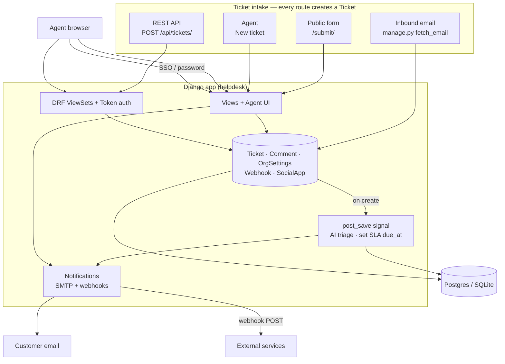
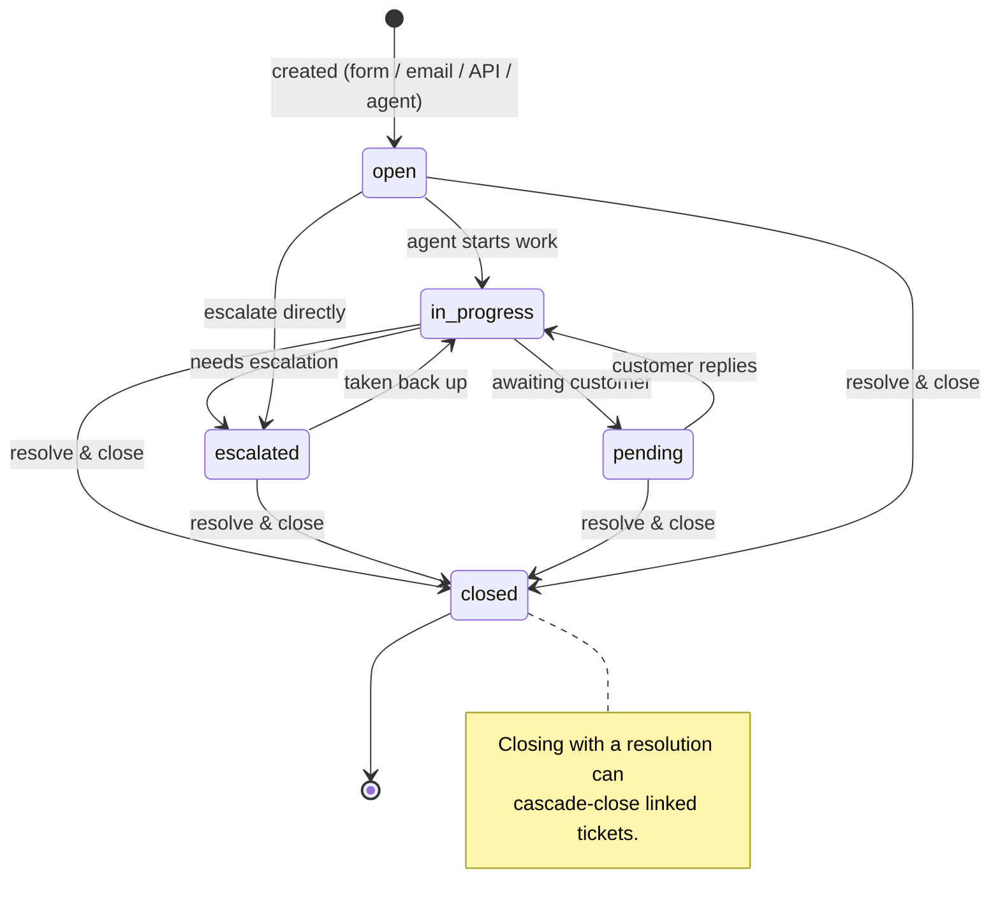
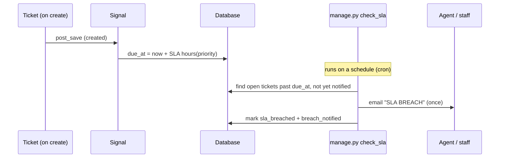
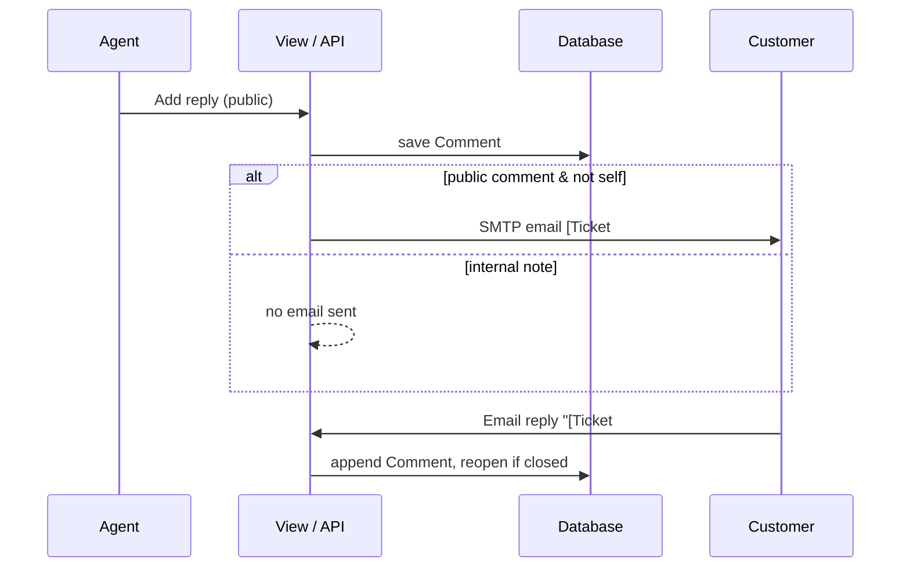
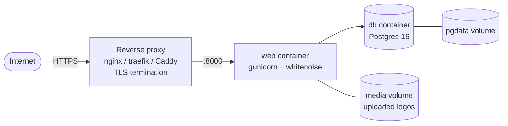

# Deskless

A lightweight, self-hostable ticketing system. **Django + DRF. MIT licensed** — you own it, customize it, and keep client work private.

## Features

- **Ticket workflow** — Open → In Progress → Pending → Escalated → Closed, with per-priority SLA deadlines
- **Conversations** — threaded public replies + internal notes
- **Linked tickets** — link related issues; closing one can cascade-close the rest with a shared resolution
- **Queue** — left-panel views (Open / My tickets / Unassigned / Closed / All) with live counts, search, pagination
- **Dashboard** — landing widgets: open, escalated, assigned-to-me, unassigned, closed
- **SLA engine** — resolution targets per priority, overdue flagging, breach emails
- **Email** — public intake form, email-to-ticket (IMAP), notifications (SMTP): new/assigned/reply/breach
- **AI triage** — auto-sets priority on new tickets (keywords, or an LLM if `OPENAI_API_KEY` is set)
- **Roles & team** — customer / agent / admin, managed in-app
- **Branding** — org name, logo upload, and theme colors, editable in Settings (no redeploy)
- **SSO** — Google, Microsoft, Zoho via OAuth; SSO users auto-provision as agents
- **Integrations** — REST API (token auth) + outbound webhooks on ticket events
- **Reports** — counts by status/priority/agent, average time to resolve

## Architecture



## Ticket lifecycle



## SLA + breach flow



## Reply + notification flow



## Project structure

```
Deskless/
├── helpdesk/               # project config
│   ├── settings.py         # env-driven; SQLite→Postgres, console→SMTP, allauth, SLA
│   ├── urls.py             # web + /api/ + token + allauth (SSO) + media
│   └── wsgi.py
├── tickets/                # the app
│   ├── models.py           # Ticket · Comment · OrgSettings · Webhook  ← the asset
│   ├── views.py            # dashboard, queue, detail, reports, team, settings, intake
│   ├── forms.py            # ticket / comment / close / link / org / new-user forms
│   ├── api.py              # DRF ViewSets
│   ├── serializers.py
│   ├── signals.py          # AI triage · SLA due_at · webhooks · SSO auto-agent
│   ├── notifications.py    # staff emails: new / assigned / breach
│   ├── context_processors.py  # branding (DB→env) + SSO providers → templates
│   ├── admin.py
│   ├── management/commands/
│   │   ├── fetch_email.py   # IMAP → tickets
│   │   └── check_sla.py     # flag + email SLA breaches (cron)
│   └── templates/
├── Dockerfile
├── docker-compose.yml      # web (gunicorn+whitenoise) + Postgres
├── entrypoint.sh           # migrate + gunicorn
├── requirements.txt
├── .env.example            # all config
└── LICENSE                 # MIT
```

## Local development

```bash
python -m venv .venv
.venv/Scripts/pip install -r requirements.txt   # Windows; use .venv/bin on Linux/Mac
.venv/Scripts/python manage.py migrate
.venv/Scripts/python manage.py createsuperuser
.venv/Scripts/python manage.py runserver
```

| Route | What |
|-------|------|
| `/` | Dashboard (widgets) |
| `/queue/` | Ticket queue with left-panel views |
| `/t/<id>/` | Ticket detail — reply, assign, status, link, close |
| `/new/` | Agent logs a ticket (phone/walk-in) |
| `/reports/` | Reports |
| `/team/` | Team & roles (admins) |
| `/settings/` | Branding, logo, SLA targets, SSO (admins) |
| `/submit/` | Public request form |
| `/admin/` | Django admin |
| `/api/tickets/`, `/api/comments/` | REST API |
| `POST /api/token/` | Get an API token |

Defaults to SQLite and prints email to the console — no setup needed.

### Get an API token
```bash
curl -X POST http://127.0.0.1:8000/api/token/ -d "username=admin&password=yourpass"
curl -H "Authorization: Token <key>" http://127.0.0.1:8000/api/tickets/
```

## Scheduled jobs

Two management commands are meant to run on a schedule (cron / Task Scheduler):

```bash
python manage.py fetch_email   # pull inbound email into tickets
python manage.py check_sla     # flag overdue tickets and email breaches (every ~15 min)
```

## Integrations

- **REST API** — full CRUD on tickets & comments (token or session auth).
- **Outbound webhooks** — add a `Webhook` (URL + event) in the admin. Deskless POSTs JSON on `ticket.created` and `ticket.closed`:
  ```json
  { "event": "ticket.closed",
    "ticket": { "id": 42, "subject": "...", "status": "closed",
                "priority": "high", "resolution": "...", "reporter": "user@x.com" } }
  ```

## Single sign-on (SSO)

Google, Microsoft, and Zoho via [django-allauth](https://docs.allauth.org).

1. Create an OAuth app in the provider's console (Google Cloud / Azure / Zoho).
2. In Deskless: **Settings → Configure SSO provider** (Django admin → Social Applications), paste the Client ID & Secret, attach it to the site.
3. Buttons appear on the login page automatically. SSO users are provisioned as agents.

Set the redirect/callback URL in the provider to `https://<your-host>/accounts/<provider>/login/callback/`.

## Deployment



```bash
cp .env.example .env   # set SECRET_KEY, ALLOWED_HOSTS, CSRF_TRUSTED_ORIGINS, DB_PASSWORD, email, branding
docker compose up -d --build
docker compose exec web python manage.py createsuperuser
```

- `web` runs `migrate` then gunicorn; static served by whitenoise (no separate static host).
- `db` is health-gated — `web` waits for Postgres to be ready.
- **Put a reverse proxy with TLS in front** (port 8000 is plain HTTP). When `DEBUG=False`, the app enables HTTPS redirect, secure cookies, and HSTS, and trusts `X-Forwarded-Proto` from the proxy.
- Uploaded logos live in `MEDIA_ROOT` — mount it as a volume (or use S3) so they survive redeploys.

### Email-to-ticket
Set `IMAP_*` in `.env`, then poll on a schedule:
```bash
docker compose exec web python manage.py fetch_email
```
Replies with `[Ticket #N]` in the subject append to that ticket and reopen it; anything else becomes a new ticket.

## Configuration

All via environment — see [.env.example](.env.example). No env set = dev-safe defaults (SQLite, console email). Branding and SLA targets are also editable in-app under **Settings** (DB values override env).

| Var | Purpose | Default |
|-----|---------|---------|
| `SECRET_KEY` | Django crypto key | insecure dev key |
| `DEBUG` | Debug mode | `True` |
| `ALLOWED_HOSTS` | Comma-separated hostnames | `localhost,127.0.0.1,testserver` |
| `CSRF_TRUSTED_ORIGINS` | Comma-separated `https://` origins | empty |
| `DATABASE_URL` | Postgres URL | SQLite file |
| `BRAND_NAME` / `BRAND_COLOR` / `BRAND_ACCENT` | Fallback theming (Settings overrides) | Deskless / greys |
| `EMAIL_HOST` + `EMAIL_*` | Outbound SMTP (blank = console) | console |
| `IMAP_HOST` + `IMAP_*` | Inbound email-to-ticket (blank = off) | off |
| `OPENAI_API_KEY` | Enable LLM triage (else keywords) | off |

## Roadmap (next phase)

Knowledge base / canned replies · categories & tags · attachments · audit log · business-hours-aware SLA · CSAT rating · bulk actions.

## License
MIT — see [LICENSE](LICENSE).
