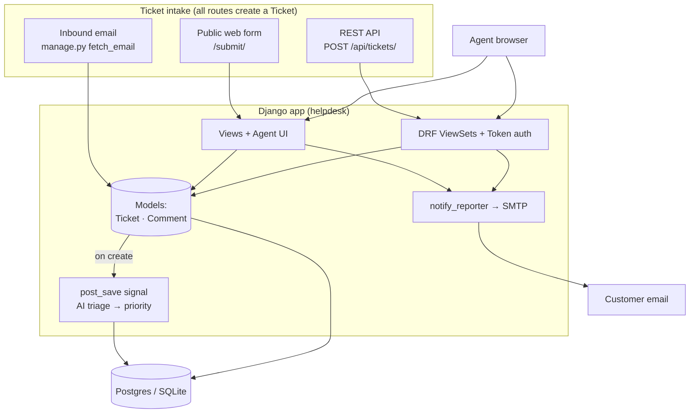
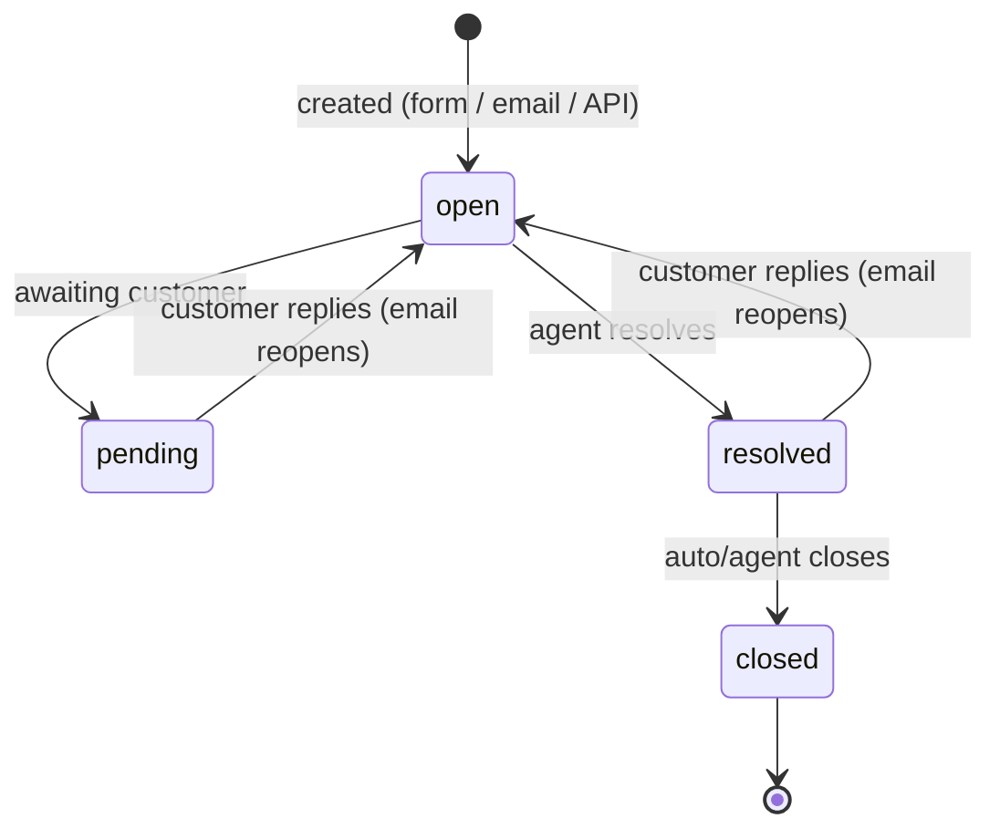
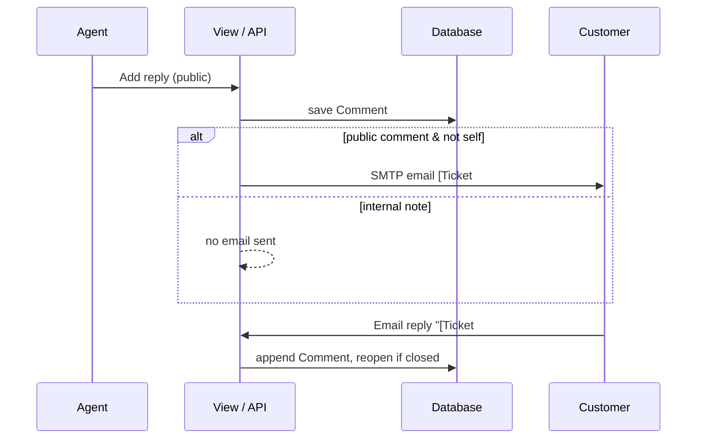
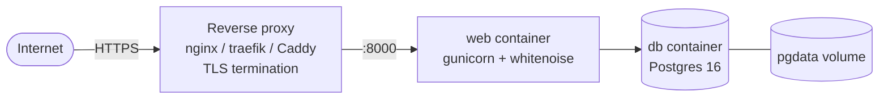

# Deskless

A lightweight, self-hostable ticketing system. **Django + DRF. MIT licensed** — you own it, customize it, and keep client work private.

## Features
- Ticket + threaded comments (public replies & internal notes)
- Agent UI: list, filter, search, assign, status/priority
- Public intake form + email-to-ticket (IMAP) + email notifications (SMTP)
- Auto-triage priority on new tickets (keywords, or LLM if `OPENAI_API_KEY` set)
- REST API (token auth) for integrations
- Reports dashboard
- Per-client branding via env vars

## Architecture



## Ticket lifecycle



## Reply + notification flow



## Project structure

```
Ticketingsystem/
├── helpdesk/               # project config
│   ├── settings.py         # env-driven; SQLite→Postgres, console→SMTP
│   ├── urls.py             # web + /api/ router + token + auth
│   └── wsgi.py
├── tickets/                # the app
│   ├── models.py           # Ticket, Comment  ← the whole asset
│   ├── views.py            # agent UI, public submit, reports, notify_reporter
│   ├── forms.py            # update / comment / public forms
│   ├── api.py              # DRF ViewSets
│   ├── serializers.py
│   ├── signals.py          # AI triage on ticket creation
│   ├── context_processors.py  # branding → templates
│   ├── admin.py
│   ├── management/commands/fetch_email.py  # IMAP → tickets
│   └── templates/
├── Dockerfile
├── docker-compose.yml      # web (gunicorn+whitenoise) + Postgres
├── entrypoint.sh           # migrate + gunicorn
├── requirements.txt
├── .env.example            # all config
└── LICENSE                 # MIT
```

## Local development

```bash
python -m venv .venv
.venv/Scripts/pip install -r requirements.txt   # Windows; use .venv/bin on Linux/Mac
.venv/Scripts/python manage.py migrate
.venv/Scripts/python manage.py createsuperuser
.venv/Scripts/python manage.py runserver
```

| Route | What |
|-------|------|
| `/` | Agent ticket list (login required) |
| `/t/<id>/` | Ticket detail — reply, assign, status |
| `/reports/` | Dashboard |
| `/submit/` | Public request form |
| `/admin/` | Django admin |
| `/api/tickets/`, `/api/comments/` | REST API |
| `POST /api/token/` | Get an API token |

Defaults to SQLite and prints email to the console — no setup needed.

### Get an API token
```bash
curl -X POST http://127.0.0.1:8000/api/token/ -d "username=admin&password=yourpass"
curl -H "Authorization: Token <key>" http://127.0.0.1:8000/api/tickets/
```

## Deployment



```bash
cp .env.example .env   # set SECRET_KEY, ALLOWED_HOSTS, CSRF_TRUSTED_ORIGINS, DB_PASSWORD, email, branding
docker compose up -d --build
docker compose exec web python manage.py createsuperuser
```

- `web` runs `migrate` then gunicorn; static served by whitenoise (no separate static host).
- `db` is health-gated — `web` waits for Postgres to be ready.
- **Put a reverse proxy with TLS in front** (port 8000 is plain HTTP). When `DEBUG=False`, the app enables HTTPS redirect, secure cookies, and HSTS, and trusts `X-Forwarded-Proto` from the proxy.

### Email-to-ticket
Set `IMAP_*` in `.env`, then poll on a schedule (cron / Task Scheduler):
```bash
docker compose exec web python manage.py fetch_email
```
Replies with `[Ticket #N]` in the subject append to that ticket and reopen it; anything else becomes a new ticket.

## Configuration

All via environment — see [.env.example](.env.example). No env set = dev-safe defaults (SQLite, console email).

| Var | Purpose | Default |
|-----|---------|---------|
| `SECRET_KEY` | Django crypto key | insecure dev key |
| `DEBUG` | Debug mode | `True` |
| `ALLOWED_HOSTS` | Comma-separated hostnames | `localhost,127.0.0.1,testserver` |
| `CSRF_TRUSTED_ORIGINS` | Comma-separated `https://` origins | empty |
| `DATABASE_URL` | Postgres URL | SQLite file |
| `BRAND_NAME` / `BRAND_COLOR` / `BRAND_ACCENT` | Per-client theming | Deskless / greys |
| `EMAIL_HOST` + `EMAIL_*` | Outbound SMTP (blank = console) | console |
| `IMAP_HOST` + `IMAP_*` | Inbound email-to-ticket (blank = off) | off |
| `OPENAI_API_KEY` | Enable LLM triage (else keywords) | off |

## License
MIT — see [LICENSE](LICENSE).
